# RuPay Exchange — Technical Flow & System Documentation

> How the app is connected, how data flows, and how every operation works internally.

---

## Table of Contents

1. [How Components Are Connected](#1-how-components-are-connected)
2. [App Startup Flow](#2-app-startup-flow)
3. [How Login Works](#3-how-login-works)
4. [How Registration Works](#4-how-registration-works)
5. [How Data is Saved & Loaded](#5-how-data-is-saved--loaded)
6. [How Navigation Works](#6-how-navigation-works)
7. [How PIN Verification Works](#7-how-pin-verification-works)
8. [How Buy Crypto Works](#8-how-buy-crypto-works)
9. [How Sell Crypto Works](#9-how-sell-crypto-works)
10. [How Transfer Works](#10-how-transfer-works)
11. [How Wallet (Deposit & Withdraw) Works](#11-how-wallet-deposit--withdraw-works)
12. [How Transaction History Works](#12-how-transaction-history-works)
13. [How Admin Panel Works](#13-how-admin-panel-works)
14. [How All Views Share Data](#14-how-all-views-share-data)

---

## 1. How Components Are Connected

Every part of the app has a specific role. Here is how they all connect to each other:

```
┌─────────────────────────────────────────────────────────┐
│                    SimpleXApp.java                      │
│              (Entry point - starts everything)           │
└───────────────────────┬─────────────────────────────────┘
                        │ creates
                        ▼
┌─────────────────────────────────────────────────────────┐
│              NavigationController.java                   │
│   - Manages which screen is visible                      │
│   - Creates all 9 View objects at startup                │
│   - Shows/hides the bottom navigation bar                │
└──────┬──────────────────────────────────────────────────┘
       │ creates & stores
       ▼
┌─────────────────────────────────────────────────────────┐
│         All Views (LoginView, DashboardView, etc.)       │
│   - Each view extends BaseView                           │
│   - BaseView gives every view two things:                │
│       1. navController  → to switch screens              │
│       2. dataService    → to read/write data             │
└──────┬──────────────────────────────────────────────────┘
       │ all views call
       ▼
┌─────────────────────────────────────────────────────────┐
│                   DataService.java                       │
│   - ONE instance shared by the entire app (Singleton)    │
│   - Holds all users, cryptos, transactions in memory     │
│   - Reads from and writes to rupay_db.dat                │
└──────┬──────────────────────────────────────────────────┘
       │ reads/writes
       ▼
┌─────────────────────────────────────────────────────────┐
│                   rupay_db.dat                           │
│   - Binary file on disk                                  │
│   - Stores: users, passwords, withdrawal requests        │
└─────────────────────────────────────────────────────────┘
```

**Key rule:** Views never talk to each other directly. They only talk to `DataService` for data and `NavigationController` for screen changes.

---

## 2. App Startup Flow

```
User runs: mvn javafx:run   or   run-presentation.bat
                │
                ▼
        SimpleXApp.main()
                │
                ▼
        JavaFX launch() called
                │
                ▼
        SimpleXApp.start(Stage)
          ├── Creates NavigationController
          │       ├── Creates a StackPane (root container)
          │       ├── Creates all 9 View objects (stored in a Map)
          │       │     Each view gets navController + dataService references
          │       └── Creates bottom navigation bar (hidden initially)
          │
          ├── DataService.getInstance() called (Singleton created)
          │       ├── loadDatabase() → reads rupay_db.dat from disk
          │       │     If file exists  → loads users, passwords, withdrawals
          │       │     If NOT exists   → creates demo data + saves file
          │       └── initializeCryptos() → loads BTC, ETH, USDT, BNB, XRP prices
          │
          ├── Sets window: 400×800px, title="RuPay Exchange", non-resizable
          └── navigateTo("login") → shows Login screen
```

---

## 3. How Login Works

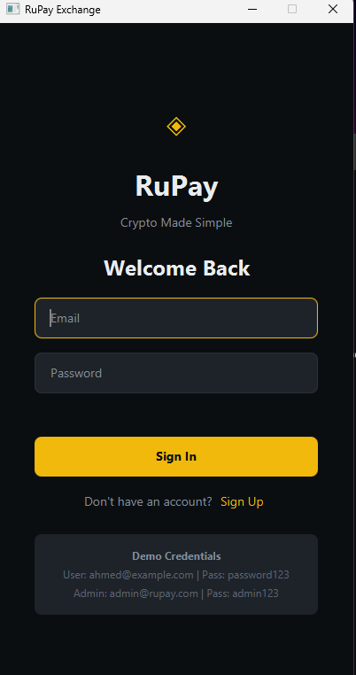

The **Login Screen** is the entry point of the app. The user enters their email and password to authenticate.

### Step-by-step flow:

```
User types email + password → clicks "Sign In"
                │
                ▼
        LoginView.handleLogin()
          ├── Checks if email or password field is empty
          │     └── If empty → shows error "Please enter both email and password"
          │
          └── Calls DataService.login(email, password)
                        │
                        ▼
                DataService.login()
                  ├── Calls loadDatabase()    ← syncs from disk first
                  ├── Converts email to lowercase
                  ├── Looks up user in users Map  (key = email)
                  ├── Looks up password in userPasswords Map
                  │
                  ├── If user found AND passwords match:
                  │       ├── Sets currentUser = this user (stored in memory)
                  │       └── Returns the User object
                  │
                  └── If NOT found or wrong password:
                          └── Returns null
                                  │
                ◄─────────────────┘
                │
        LoginView receives result:
          ├── If null   → shows error "Invalid credentials"
          └── If User   → checks user.isAdmin()
                  ├── isAdmin = true  → navigateTo("admin")
                  └── isAdmin = false → navigateTo("dashboard")
```

### Data verification in detail:

```java
// Inside DataService.login():
User user = users.get(cleanEmail);                        // find user by email
String savedPassword = userPasswords.get(cleanEmail);     // get stored password

if (user != null && savedPassword != null && savedPassword.equals(password)) {
    currentUser = user;   // remember who is logged in
    return user;          // success
}
return null;              // fail
```

---

## 4. How Registration Works

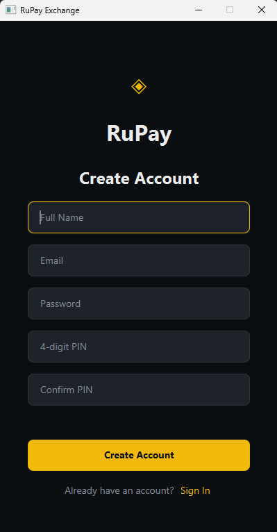

The **Register Screen** lets new users create an account with their name, email, password, and a 4-digit security PIN.

### Validation rules (checked in order):

| Check | Rule | Error shown |
|---|---|---|
| Name | Must not be empty | "Please enter your name" |
| Email domain | Must end with @gmail.com, @yahoo.com, @outlook.com, or @example.com | "Please use a valid Gmail, Yahoo, or Outlook email" |
| Password length | Must be at least 6 characters | "Password must be at least 6 characters" |
| PIN format | Must be exactly 4 numeric digits | "PIN must be 4 digits" |
| PIN match | PIN and Confirm PIN must be identical | "PINs do not match" |
| Email unique | Email must not already exist in database | "Email already registered" |

### Flow after validation passes:

```
All validations pass
        │
        ▼
RegisterView calls DataService.register(name, email, password, pin)
        │
        ▼
DataService.register()
  ├── loadDatabase()           ← sync from disk to check latest registrations
  ├── Converts email to lowercase
  ├── Checks if email key already exists in users Map
  │       └── If exists → return null (email taken)
  │
  ├── Creates new User object:
  │       ├── id = random UUID
  │       ├── name, email, pin = from form
  │       ├── pkrBalance = 0.0
  │       ├── isAdmin = false
  │       └── cryptoHoldings = {BTC:0, ETH:0, USDT:0, BNB:0, XRP:0}
  │
  ├── Adds to users Map (key = lowercase email)
  ├── Adds to userPasswords Map (key = lowercase email)
  ├── saveDatabase()           ← writes to rupay_db.dat immediately
  ├── Sets currentUser = new user
  └── Returns the new User object
        │
        ▼
RegisterView → navigateTo("dashboard")
```

---

## 5. How Data is Saved & Loaded

All data is stored in a single binary file: **`rupay_db.dat`**

### What is saved:

```
rupay_db.dat contains:
{
    "users"       → Map<String, User>         (email → User object)
    "passwords"   → Map<String, String>       (email → password string)
    "withdrawals" → List<WithdrawRequest>     (all withdrawal requests)
}
```

> Crypto market prices are NOT saved — they are always re-initialized fresh at startup.

### Save process:

```
DataService.saveDatabase()
  ├── Creates a HashMap bundle with users, passwords, withdrawals
  ├── Opens FileOutputStream → rupay_db.dat
  ├── Wraps in ObjectOutputStream
  └── Writes entire bundle as one serialized Java object
```

### Load process:

```
DataService.loadDatabase()
  ├── Checks if rupay_db.dat file exists on disk
  │
  ├── If EXISTS:
  │       ├── Opens FileInputStream → rupay_db.dat
  │       ├── Reads the bundle object (ObjectInputStream)
  │       └── Extracts: users, passwords, withdrawals into memory
  │
  └── If NOT EXISTS (first run):
          └── initializeFreshData()
                  ├── Creates demo user "Ahmed Khan"
                  ├── Creates admin account
                  ├── Creates a sample withdrawal request
                  └── saveDatabase() → creates the file for the first time
```

### When is save triggered?

| Action | Save triggered? |
|---|---|
| Register new user | ✅ Yes |
| Buy crypto | ✅ Yes |
| Sell crypto | ✅ Yes |
| Transfer crypto | ✅ Yes |
| Deposit PKR | ✅ Yes |
| Request withdrawal | ✅ Yes |
| Admin approve/reject withdrawal | ✅ Yes |
| Login / Logout / Navigate | ❌ No |

---

## 6. How Navigation Works

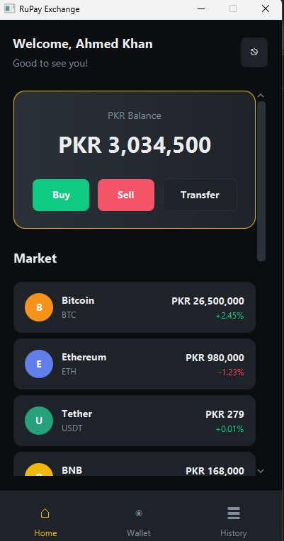

The **Dashboard** is shown after login. The `NavigationController` manages all screen switching using a pre-built Map of all views.

```
// All views are pre-created at startup and stored in a Map:
views = {
    "login"     → LoginView,
    "register"  → RegisterView,
    "dashboard" → DashboardView,
    "buy"       → BuyView,
    "sell"      → SellView,
    "transfer"  → TransferView,
    "wallet"    → WalletView,
    "history"   → HistoryView,
    "admin"     → AdminView
}
```

### When navigateTo("dashboard") is called:

```
navigateTo("dashboard")
        │
        ▼
  1. Looks up "dashboard" in views Map → gets DashboardView object
  2. Decides whether to show bottom nav:
        login / register / admin → HIDE nav bar
        all others               → SHOW nav bar
  3. Highlights the active nav button (Home / Wallet / History)
  4. Calls view.refresh(data)   ← view reloads its content from DataService
  5. Clears the content area
  6. Adds the new view's UI into the content area
```

### The screen layout structure:

```
Window (400×800)
└── StackPane (root)
    ├── VBox (main container)
    │   ├── StackPane (content area)   ← active screen displayed here
    │   └── HBox (bottom nav bar)      ← Home | Wallet | History
    │
    └── [PIN Popup overlay]            ← added on top when PIN is needed
```

---

## 7. How PIN Verification Works

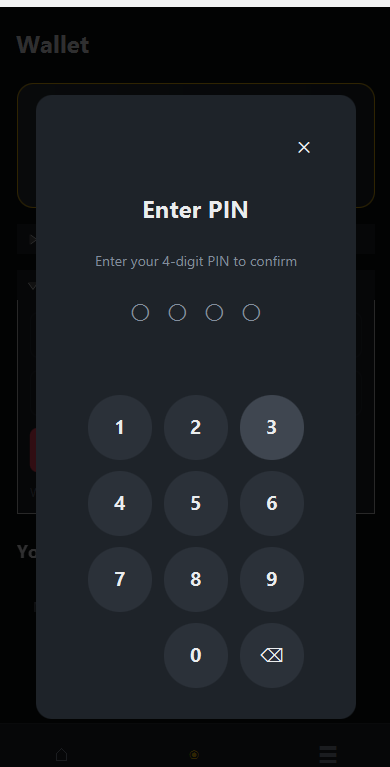

PIN verification is required before any financial transaction (Buy, Sell, Transfer, Withdraw).

```
User clicks "Buy Now" / "Sell Now" / "Transfer" / "Request Withdrawal"
        │
        ▼
View calls: navController.showPinPopup(onSuccessCallback)
        │
        ▼
NavigationController.showPinPopup()
  ├── Creates a new PinPopupView
  └── Adds it on top of the StackPane (overlay layer — covers everything)

User sees the PIN popup (number pad + 4 dots)
        │
        ▼
User taps digit buttons (0-9) or backspace
        │
        ▼
PinPopupView.handleNumber()
  ├── Appends digit to pinBuilder string
  ├── Updates dots display: ○ → ●
  └── When 4th digit is entered → auto-calls verifyPin()

PinPopupView.verifyPin()
  ├── Calls DataService.verifyPin(pin)
  │       └── Returns: currentUser.getPin().equals(enteredPin)
  │
  ├── If PIN CORRECT:
  │       ├── closePinPopup()  → removes overlay from StackPane
  │       └── Runs onSuccess callback → executes the transaction
  │
  └── If PIN WRONG:
          ├── Shows "Invalid PIN" error message
          └── Clears all 4 dots → user can try again
```

---

## 8. How Buy Crypto Works

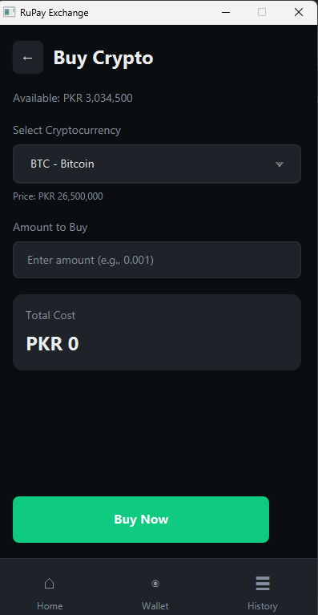

The **Buy Crypto** screen lets users purchase any supported cryptocurrency using their PKR balance.

```
User selects crypto + enters amount → clicks "Buy Now"
        │
        ▼
BuyView.handleBuy()
  ├── Validates crypto is selected
  ├── Validates amount is a positive number
  ├── Calculates total cost = amount × crypto.priceInPKR
  ├── Checks: user.pkrBalance >= total cost
  │       └── If not → shows "Insufficient balance"
  │
  └── navController.showPinPopup(callback)

[PIN entered correctly]
        │
        ▼
DataService.buyCrypto(symbol, amount)
  ├── Deducts cost from user.pkrBalance
  ├── Adds amount to user.cryptoHoldings[symbol]
  ├── Creates Transaction(type=BUY, status=COMPLETED)
  ├── Adds transaction to user.transactionHistory (newest first)
  ├── saveDatabase()
  └── Returns true

BuyView → navigateTo("dashboard")
```

---

## 9. How Sell Crypto Works

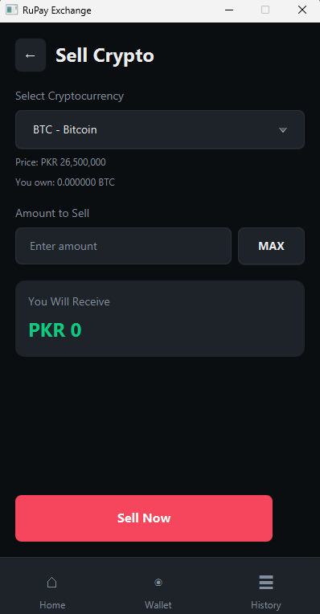

The **Sell Crypto** screen lets users sell their crypto holdings back to PKR.

```
User selects crypto + enters amount → clicks "Sell Now"
        │
        ▼
SellView.handleSell()
  ├── Validates crypto is selected
  ├── Validates amount is a positive number
  ├── Checks: user.cryptoHoldings[symbol] >= amount
  │       └── If not → shows "Insufficient crypto balance"
  │
  └── navController.showPinPopup(callback)

[PIN entered correctly]
        │
        ▼
DataService.sellCrypto(symbol, amount)
  ├── Calculates value = amount × crypto.priceInPKR
  ├── Deducts amount from user.cryptoHoldings[symbol]
  ├── Adds value to user.pkrBalance
  ├── Creates Transaction(type=SELL, status=COMPLETED)
  ├── saveDatabase()
  └── Returns true
```

---

## 10. How Transfer Works

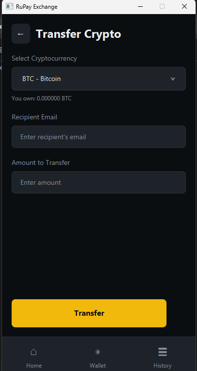

The **Transfer** screen lets users send cryptocurrency to another registered user by their email address.

```
User selects crypto + enters recipient email + amount → clicks "Transfer"
        │
        ▼
TransferView.handleTransfer()
  ├── Validates all fields are filled
  ├── Checks: recipient email ≠ current user email (can't send to yourself)
  └── navController.showPinPopup(callback)

[PIN entered correctly]
        │
        ▼
DataService.transferCrypto(symbol, amount, recipientEmail)
  ├── loadDatabase()              ← reloads to get latest recipient data
  ├── Looks up recipient by email in users Map
  ├── Validates: recipient exists, not self, sender has enough holdings
  │
  ├── SENDER:
  │       ├── Deducts amount from sender.cryptoHoldings[symbol]
  │       └── Creates Transaction(type=TRANSFER_OUT) → added to sender history
  │
  ├── RECIPIENT:
  │       ├── Adds amount to recipient.cryptoHoldings[symbol]
  │       └── Creates Transaction(type=TRANSFER_IN) → added to recipient history
  │
  ├── saveDatabase()              ← saves both users' updated data
  └── Returns true
```

---

## 11. How Wallet (Deposit & Withdraw) Works

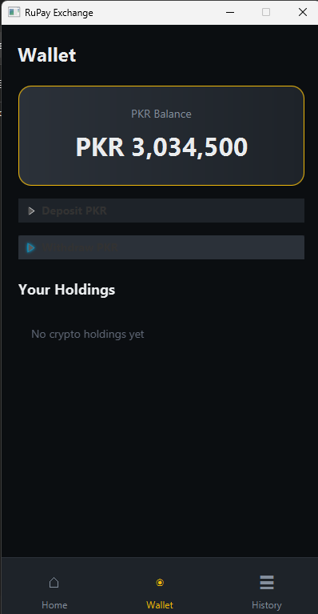

The **Wallet** screen shows the user's PKR balance and all crypto holdings.

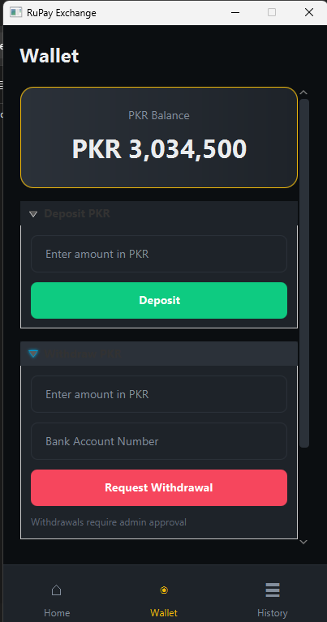

Expanding the panels reveals the **Deposit** and **Withdraw** forms.

### Deposit PKR (instant):

```
User enters amount → clicks "Deposit"
        │
        ▼
DataService.depositPKR(amount)
  ├── Adds amount directly to user.pkrBalance
  ├── Creates Transaction(type=DEPOSIT, status=COMPLETED)
  ├── saveDatabase()
  └── Returns true   ← balance updated immediately, no PIN required
```

### Withdraw PKR (requires admin approval):

```
User enters amount + bank account → clicks "Request Withdrawal"
        │
        ▼
navController.showPinPopup(callback)

[PIN entered correctly]
        │
        ▼
DataService.requestWithdraw(amount, bankAccount)
  ├── Creates WithdrawRequest:
  │       └── status = PENDING  ← NOT approved yet, balance NOT deducted yet
  ├── Creates Transaction(type=WITHDRAW, status=PENDING)
  ├── saveDatabase()
  └── Returns true   ← balance only deducted when admin approves
```

> **Important:** The PKR balance is **not deducted** when the request is submitted — only when the Admin approves it.

---

## 12. How Transaction History Works

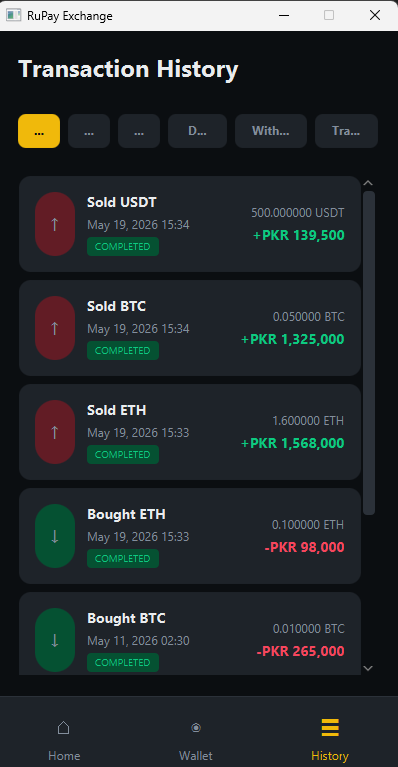

The **History** screen shows the complete log of all transactions for the logged-in user.

```
HistoryView.refresh()
        │
        ▼
DataService.getUserTransactions()
  └── Returns currentUser.transactionHistory (newest first)

HistoryView displays each transaction with:
  - Icon (↓ buy, ↑ sell, + deposit, - withdraw, ← in, → out)
  - Description (e.g., "Bought BTC", "Sold ETH")
  - Date and time
  - Amount in PKR (green = credit, red = debit)
  - Status badge (COMPLETED / PENDING / FAILED)

Filter buttons at the top:
  All | Buy | Sell | Deposit | Withdraw | Transfer
        │
        ▼
DataService.getFilteredTransactions(type)
  └── Filters transactionHistory list by Transaction.Type
```

---

## 13. How Admin Panel Works

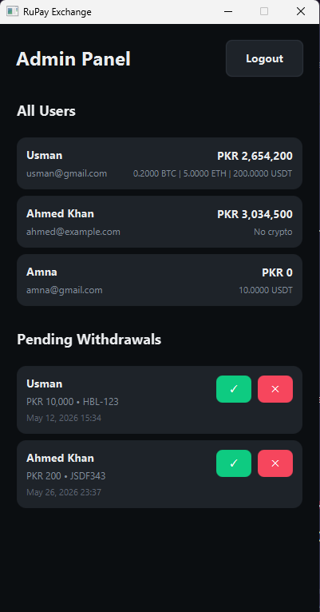

The Admin Panel is only accessible when logged in with the admin account (`admin@rupay.com`).

### How admin sees all users:

```
AdminView.refresh()
  └── DataService.getAllUsers()
          └── Returns all values from users Map
                  │
                  ▼
          AdminView filters out admin accounts (isAdmin = true)
          Displays for each regular user:
            - Name + email
            - PKR balance
            - Crypto holdings (BTC, ETH, USDT if > 0)
```

### How admin approves a withdrawal:

```
Admin clicks "✓" Approve button
        │
        ▼
DataService.approveWithdrawal(requestId)
  ├── Finds WithdrawRequest by ID
  ├── Sets request.status = APPROVED
  ├── Looks up user by request.userEmail
  ├── Deducts request.amount from user.pkrBalance  ← balance deducted HERE
  ├── saveDatabase()
  └── AdminView.refresh() → request disappears from pending list
```

### How admin rejects a withdrawal:

```
Admin clicks "✕" Reject button
        │
        ▼
DataService.rejectWithdrawal(requestId)
  ├── Finds WithdrawRequest by ID
  ├── Sets request.status = REJECTED
  │       └── Balance is NOT affected (was never deducted)
  ├── saveDatabase()
  └── AdminView.refresh() → request disappears from pending list
```

---

## 14. How All Views Share Data

Every view extends `BaseView`. This is the foundation that connects all views to data:

```java
// BaseView.java
public abstract class BaseView {
    protected NavigationController navController;  // for screen switching
    protected DataService dataService;             // for all data access

    public BaseView(NavigationController navController) {
        this.navController = navController;
        this.dataService = DataService.getInstance(); // same singleton every time
    }
}
```

Because `DataService` is a **Singleton**, every view always accesses the **same single instance** — meaning data changes in one view are immediately visible in all other views.

### The refresh() pattern:

Every view has a `refresh()` method. When `navigateTo()` is called, it always calls `refresh()` on the target view before showing it, ensuring the latest data is always displayed.

```
navigateTo("wallet")
    └── walletView.refresh(null)
            ├── dataService.getCurrentUser()   → gets latest user from memory
            ├── Updates balance label
            ├── Rebuilds holdings list
            └── Clears all form fields
```

### Full data flow summary:

```
User Action (button click)
        │
        ▼
View method   (e.g., handleBuy())
        │
        ▼
DataService   (e.g., buyCrypto())
  ├── Updates User object in memory
  └── saveDatabase() → writes to rupay_db.dat
        │
        ▼
navigateTo() → refresh() on destination view
        │
        ▼
View reads from DataService → displays updated data
```

---

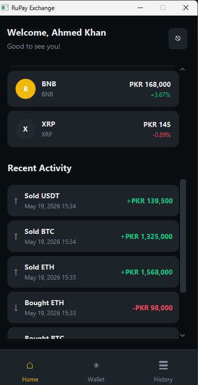

*The Dashboard's Recent Activity section reflects all transactions in real time after every operation.*

---

*Technical Flow Document — RuPay Exchange v1.0-SNAPSHOT*
